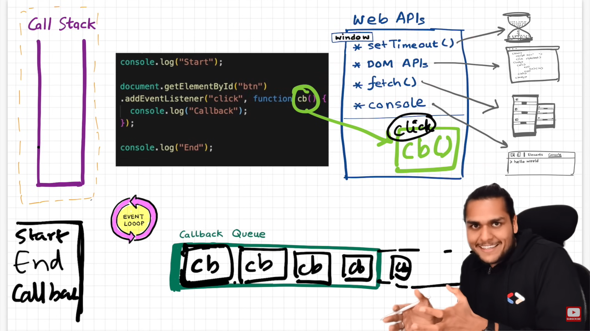
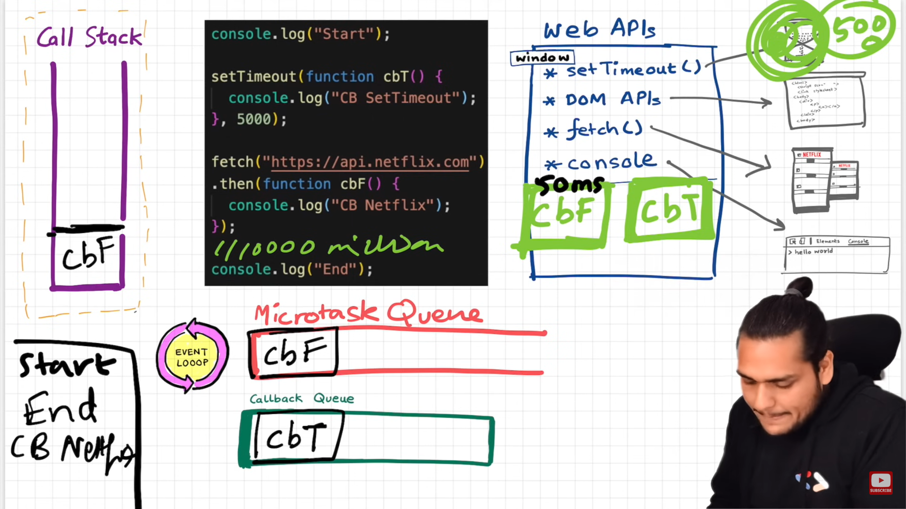
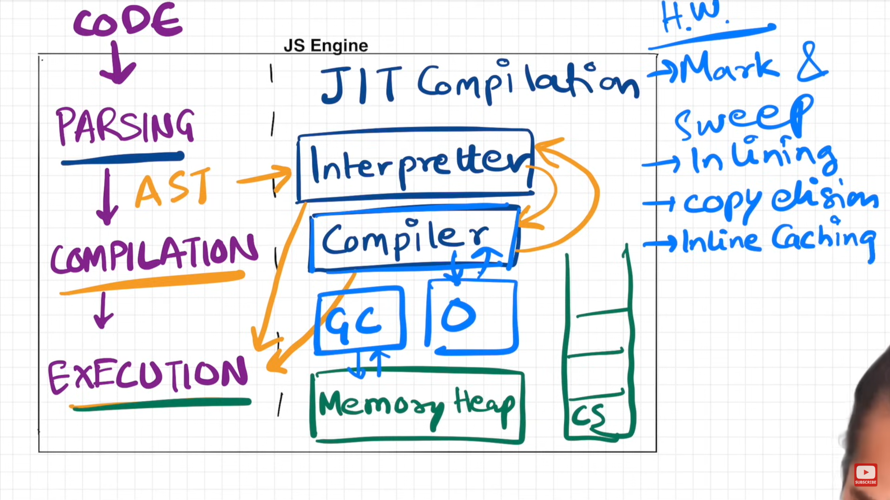
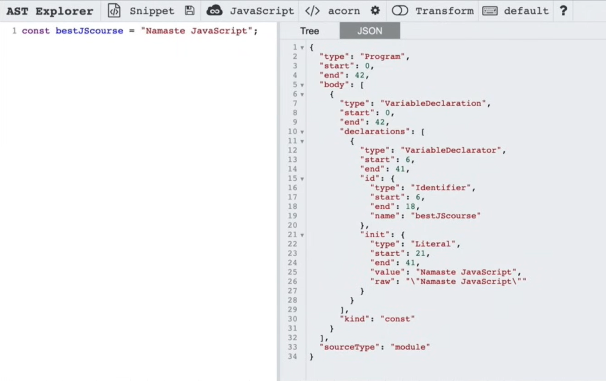
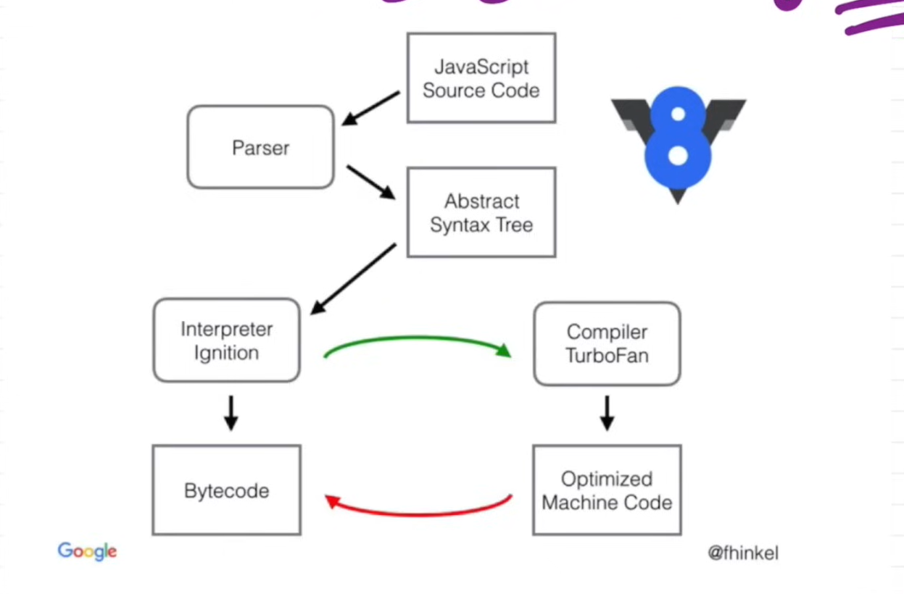

### JavaScript Overview

**JavaScript** is a synchronous, single-threaded, and high-level language.

The shortest possible JavaScript program can consist of no code at all. Even an empty JavaScript file automatically has a global execution context, which can be accessed using the `window` or `this` keyword.

#### Execution Context:
When JavaScript code runs, an execution context is created, which consists of memory and code components.

- **Memory Creation:** Before code execution starts, memory is allocated in a key-value pair format, assigning memory to each variable and function.
  - Variables are initially stored with the value `"undefined"`, while functions are stored entirely in memory.
  
- **Code Execution:** As the code runs line by line, variable values are updated, and functions are executed as they are called. Each execution context has a stack (LIFO):
  - Function contexts (for each invoked function)
  - The global execution context.

#### Hoisting:
In JavaScript, variables or functions can be used before they are declared because memory is allocated for them during the initial phase of code execution.

#### Scope:
In JavaScript, every execution context has access to its own memory as well as the memory of its parent context, known as the **lexical environment**. The global execution context has no parent lexical environment.

---

### Types of Errors:
- **Reference Error**
- **Syntax Error**
- **Type Error**

#### Temporal Dead Zone (TDZ):
It refers to the period between when a variable is hoisted (allocated memory) and when it is initialized. During this period, the variable cannot be accessed, and attempting to use it results in a `ReferenceError`.

- Both `let` and `const` are hoisted (not in the global or local lexical environment but in the script) but remain in the **Temporal Dead Zone (TDZ)** until their initialization.
- Both `let` and `const` cannot be redeclared. If redeclared, a syntax error will be thrown.
- With `let`, a variable can be initialized later after its declaration, while `const` must be initialized at the time of declaration. If not, a `TypeError` will occur.

---

#### Block:
A block is a pair of curly braces `{}` that groups multiple statements together. Blocks are essential in control structures like loops, if statements, and function definitions.

> When a variable declared with `var` is redeclared inside a block, it changes the global value (known as **shadowing**). However, this does not happen with `let` and `const`, as they are hoisted into a different memory space specific to the block.

---

### Closures:
A **closure** is a function that "remembers" and has access to its lexical scope, even when the function is executed outside that scope. In other words, a closure allows a function to access variables from an outer function after the outer function has returned.

- A closure is the combination of a function bundled together (enclosed) with references to its surrounding state (the lexical environment).
- In JavaScript, closures are created every time a function is created, at function creation time.

#### Uses/Advantages of Closures:
- Data Hiding and Encapsulation
- Module Design Pattern
- Currying
- Functions like `once`
- Memoization
- Maintaining state in asynchronous operations
- `setTimeout` callbacks
- Iterators

#### Disadvantages:
- Overconsumption of memory
- Not garbage collected (JavaScript freezes and removes unused variable memory, but not in this case)
- May freeze the browser if not handled properly

---

### Loop Example (Issue with `var`):
The following loop won't work as intended because `var` is function-scoped, causing each iteration to share the same value of `i`, which will be `6` after the loop finishes:

```js
for (var i = 1; i <= 5; ++i) {
  setTimeout(function () {
    console.log(i);
  }, i * 1000);
}
```

To fix this, you can either use let, which is block-scoped, or create a function closure to capture the current value of i at each iteration.
```js
for (var i = 1; i<=5; ++i{
  setTimeOut(function () {
    console.log(i);
  }, i * 1000);
}

for (var i = 1; i<=5; ++i{
  function close(x){
    setTimeOut(function () {
      console.log(x);
    }, x * 1000);
  }
  close(i);
}
```

---

### Function

The difference in Function Statement and Function Expression is in hoisting.<br>
a(arguement);<br>
b(); Not possible since JS will treat it as a variable and assign undefined to it during memory creation.

#### Function Statement/Function Declaration:
```js
function a(parameter){
    console.log("a called")
  }
```

#### Function Expression
  ```js
  var b = function (){
    console.log("b called");
  }
```

#### Anonymous Function 
Function without a name<br>
Should be used in Function Expression not directly or will throw error
  ```js
function (){
    console.log("Anonymous Function");
}
```

#### Named Function Expression 
  ```js
  var b = function xyz(){     // Cannot access xyz outside
    console.log("b called");
  }
```

#### First Class Function/First Class Citizen:
Functions that can be treated like any other variable. This means that a function can be assigned to a variable, passed as an argument to other functions, and returned from other functions. This concept is key to functional programming.

##### 1. Assigned to Variables
 ```js
const greet = function() {
    console.log("Hello!");
};
```

##### 2. Passed as Arguments
 ```js
function executeFunction(func) {
    func(); // Calls the passed function
}

executeFunction(greet); // Outputs: Hello!

```

##### 3. Returned from Functions
 ```js
function createCounter() {
    let count = 0;
    return function() {
        count++;
        return count;
    };
}

const counter = createCounter();
console.log(counter()); // Outputs: 1
console.log(counter()); // Outputs: 2

```

##### 4. Stored in Data Structures
 ```js
const functionArray = [greet, counter];
functionArray[0](); // Outputs: Hello!

```

##### 5. Anonymous Functions
 ```js
setTimeout(function() {
    console.log("Executed after 1 second");
}, 1000);

```

---

### Callback Function
A function that is passed as an argument to another function and is executed after some operation is completed within that function. The callback allows for asynchronous or deferred execution of code, meaning that the function receiving the callback can perform a task and once the task is completed (or at a specific point), it can "call back" the passed-in function to handle the result.

```js
setTimeout unction () {
  console. log( "timer");
}, 5000);

function x(y) {
  console. tog ("x");
}

x(function y() {
console. tog ("y");
});
```

```
// Closure Event Listener

function attachEventListeners() {
  let count = 0;
  document.getElementById("btn").addEventListener("click",
  function xyz() {
    console. log("Button Clicked", ++count);
  });
}

attachEventListeners ( ) ;
```

---

### Event Loop


> The event loop continuously monitors the Call Stack and Callback/Task Queue, moving callbacks from the queue to the stack when the stack is empty.



> Microtask Queue has higher priority than Callback Queue



> Starvation: At times, the task queue generates an excessive number of microtasks, causing tasks, like those in the Callback Queue, to be delayed or starved of execution.

> `setTimeout` does not guarantee execution at the exact time specified. Once the timer expires in the Web API's environment, the callback is moved to the callback queue. However, the event loop will only push the callback onto the call stack after the stack is empty, meaning it has completed executing the current code. Therefore, if other tasks are still running, the callback execution may be delayed.

> If we want something to be executed last in our code like a function, we can use `setTimeout with a delay of 0`. This schedules the task to be added to the callback queue, ensuring it will only be executed after the call stack is empty and all other synchronous code has run. This effectively pushes the task to the end of the execution order.

---

### JavaScript Runtime Environment

A runtime environment that include JS Engine, Web API's, Callback Queue, Microtask Queue, Event Loop...

#### JS Engine
A program or an interpreter that executes JavaScript code. It takes the JavaScript code you write and transforms it into machine-readable instructions that the computer's processor can understand and execute.

> Code -> Parsing -> Compilation -> Execution

</img>

##### Parsing
JS Engine has a syntax parser that takes the code and convert it in AST(Abstract Syntax Tree).

</img>

##### Compilaton & Execution

__Interpreter__: Early JavaScript engines were pure interpreters. They executed the JavaScript code line-by-line, but this wasn't very efficient for large or complex programs.

__JIT (Just-In-Time) Compiler__: Modern JavaScript engines use Just-In-Time compilation to improve performance. Instead of interpreting the code line-by-line, the engine compiles frequently used code into machine code at runtime, optimizing it for faster execution.

```
Examples of JS Engine:-

V8 by Google
Spider Monkey by Mozilla
JavaScriptCore (Nitro) by Apple
Chakra by Microsoft
Hermes by Meta
```
</img>

---

### Higher Order Function

A function that either takes one or more functions as arguments, returns a function as a result, or both.

```js
// calculate is a Higher Order Function.

const area = function (radius) {
  return Math. PI * radius * radius;
}

const cicumference = function (radius) {
  return 2 * Math. PI * radius;
}

const diameter = function (radius) {
  return 2 * radius;
}

const calculate = function (radius, logic) {
  const output = [];
  for (let i = 0; i < radius.length; i++) {
    output. push(logic(radius [i])) ;
  return output;
}

console. log (calculate( radius , area);
console. log (calculate( radius, circumference);
console. log (calculate( radius, diameter);

----------------------------------------------------

Array.prototype.calculate = function (logic) {
  const output = [];
  for (let i = 0; i < this.length; i++) {
    output. push( logic( radius [i] ) ) ;
  return output;
}

console.log(radius.map(area));
console.log(radius.calculate(area));

```

---

### Map, Filter & Reduce

> These are higher order functions.

#### Map

Creates a new array populated with the results of applying a provided function to every element in the calling array.

```js
//To convert array elements into binary
const arr = [2, 4, 5, 3];

function binary(x){
  return x.toString(2);
}

const result = arr.map(binary);

const result = arr.map(function binary(x){  // function directly inside map
  return x.toString(2);
}

const result = arr.map((x) => {  // arrow function inside map
  return x.toString(2);
}

// For one line we need not to return, just simply write the logic.
```

#### Filter

Creates a new array with all elements that pass the test implemented by the provided function.

```js
// To filter odd values from array
const arr = [5, 3, 4, 7, 8];

function idOdd(x){
  return x % 2;
}

const output = arr.filter(isOdd);

const output = arr.filter(function isOdd(x){
  return x % 2;
}

const output = arr.filter((x) => x % 2);
```

#### Reduce 

Executes a reducer function (that you provide) on each element of the array, resulting in a single output value.

```js
//To find max value in arr
const arr = [3, 5, 2, 7, 3];

const output = arr.reduce(function (acc, curr){
  if(acc < curr){
    acc = curr;
  }
  return acc;
}, 0);

// acc is accumulator the output initalized by 0 and curr is the current node of array.
```

```js
// To find first name of having age less than 30.
const users = [
  {firstName : "Om", lastName: "Keshri", age: 20},
  {firstName: "Demo", lastName: "User", age: 32},
]

const output = users.filter((x) => x.age < 30).map((x) => x.firstName);

const output = users.reduce((acc, curr) => {
  if (curr.age< 30) acc.push(curr.firstName);
  return acc;
}, []);
```

---

### Callback Issues

#### 1 - Callback hell
When a function is passed as an argument to another function, it becomes a callback function. When multiple callbacks are nested within other callbacks, the code expands horizontally rather than vertically. This structure is referred to as callback hell.

#### 2 - Inversion of control
When a callback function is passed to another function, control over the execution flow is shifted, making it harder to manage the code. Since the logic is handled behind the scenes, it becomes challenging to track what is happening, leading to reduced maintainability of the program.


```js
// Callback Hell or Pyramid of Loop 
const cart = ["shoes", "pants", "kurta"] ;
api.createOrder(cart, function () {  // Giving Control to api
  api.proceedToPayment(function () {
    api. showOrderSummary(function () {
      api. updateWallet()
    })
  })
})
```

---

