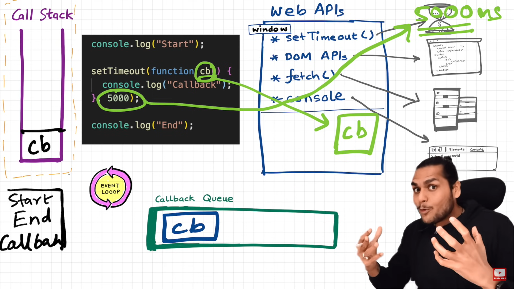
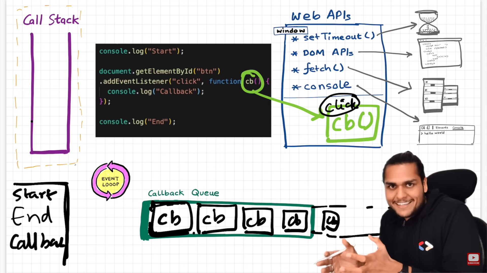
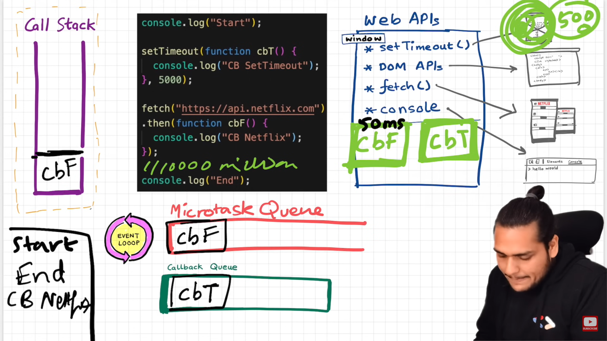
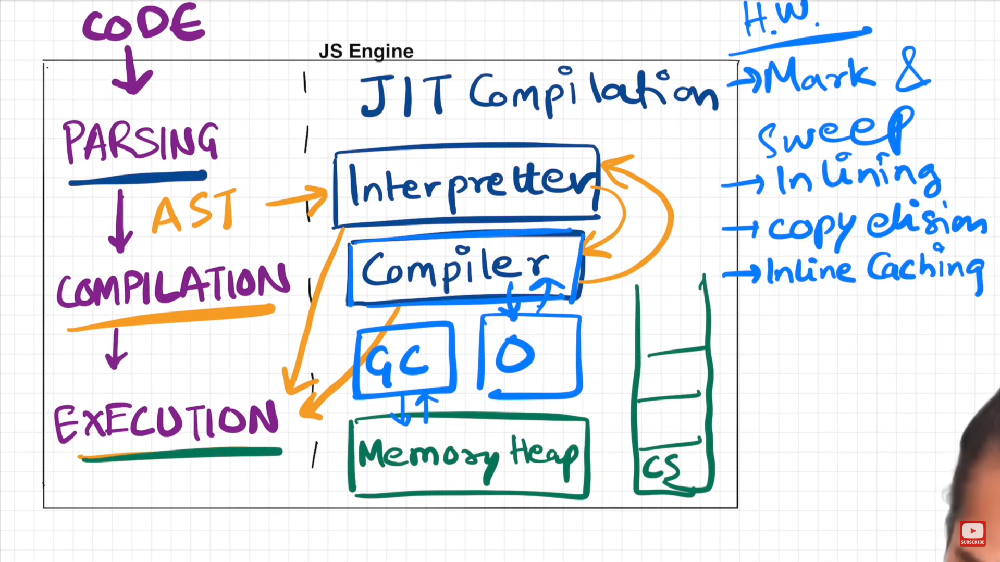
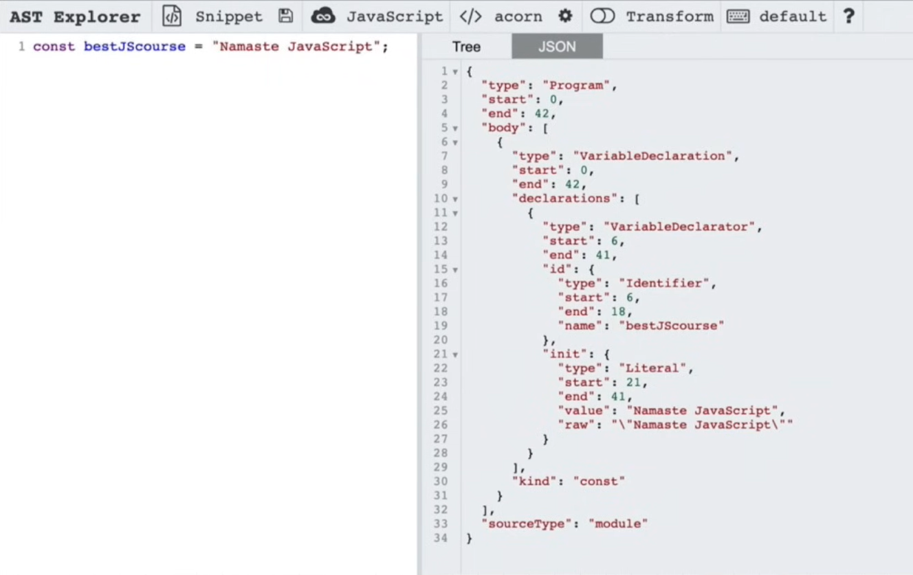
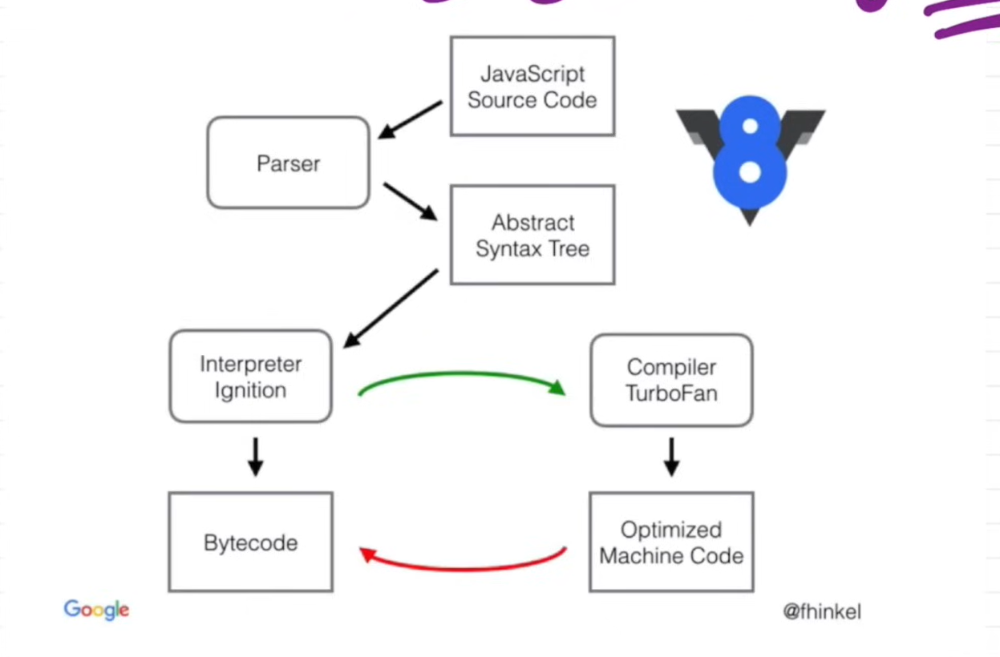

<div align="center">
  <h1>JAVASCRIPT</h1>
</div>

# History
Mocha -> LiveScript -> JavaScript

__ECMAScript (ES) is a standardized scripting language specification that serves as the foundation for JavaScript. It is maintained by ECMA International under the ECMA-262 standard. When JavaScript was created by Brendan Eich at Netscape in 1995, different browsers started implementing their own versions of JavaScript, leading to inconsistencies. To create a unified standard, ECMA International developed ECMAScript, ensuring that JavaScript remains consistent across different environments.__

__ES6 -> Biggest Update in JS in 2015(modern JS)__

__Babel is a JavaScript compiler that allows developers to use the latest ECMAScript (ES) features while ensuring compatibility with older browsers or environments that do not support them.__

# Overview
Can only use '_' and '$' symbol in variable.

# Input
1. `prompt()` (Browser-based Input) (Takes a string as input)
2. `readLine()` (For Node.Js)
```js
const readline = require("readline").createInterface({
  input: process.stdin,
  output: process.stdout
});

readline.question("Enter your name: ", (name) => {
    console.log("Hello, " + name);
    readline.close();
});
```

 ```js
 for (let i = 0; i<5; ++i){
   console.log(i);
 }
 console.log(i); // output: error
 To solve this declare i outside
 let i = 0;
 for(; i<5; ++i)
```

# Loops
1. for
2. while
3. do while
4. for each
5. for of
   Used to iterate over arrays, strings, Maps, Sets, and other iterable objects. It gives values directly.
   ```js
   let fruits = ["apple", "mango", "orange"];
   for (let fruit of fruits){
     console.log(fruit);
   }
   // output: apple, mango, orange
   ```
6. for in
  Used to iterate over object properties (keys). It gives keys (not values) of an object.
   ```js
   let obj = { name: "Alice", age: 25 };

   for (let key in obj) {
      console.log(key, obj[key]);
   }
   // Output:
   // name Alice
   // age 25


   let arr = [10, 20, 30];

   for (let index in arr) {
      console.log(index, arr[index]);
   }
   // Output: 0 10, 1 20, 2 30

   ```
   
# String
.length -> to get the length of string

If spaces given in string, it will be counted as the part of string. eg:- "Hello   "

### String Methods
1. The `.trim()` method in JavaScript is used to remove whitespace from both the beginning and end of a string. It does not modify the original string but returns a new one.
    `trimStart()`, `trimEnd()`
   .trim() also removes tabs(\t), newlines(\n, \r)

2. The 'toUpperCase()` method in JavaScript is used to conver all the characters of a string to uppercase. It does not modify the original string but returns a new one.
   
3. The 'toLowerCase()` method in JavaScript is used to conver all the characters of a string to lowercase. It does not modify the original string but returns a new one.

4. The `.slice()` method is used to extract a part of a string (or an array) and returns a new string (or array) without modifying the original.
```js
let name = "Om Keshri";
let firstName = name.slice(0, 2);  // output: Om
```

# Types of Data Types(Primitive)
`String`

`Number`

`Boolean`

`Undefined`

`null`

`BigInt` -> To declare number greater than MAX_SAFE_INTEGER(9007199254740991). let num = BigIng(1234567891011121314) of let num = 1234567891011121314n;

`Symbol`

### typeof Operator
The `typeof` operator is used to determine the data type of a given value or variable in JavaScript.

Note: When variable is not only defined not initialized it will output undefined type. Not possible in const bcoz it should be initialize while declaring.

Note: typeof null is object in JS. This is a long-standing bug in JavaScript due to historical reasons.

```js
let name = "Om Keshri";
console.log(typeof name)

// number to string
let num = 1;
let num_str = num + "";
console.log(typeof num_str) // output: string
num = String(num) // another way

// string to number
let str = "Om";
let str_num = +str;
console.log(typeof str_num); // output: number
let str = Number(str) // another way
```

### String Template
```js
let name = "Om";
let age = 20;

let aboutMe = `My name is ${name} and my age is ${age};
```

# == vs === operator and != vs !==
`=== ` and `!==` checks both value and type (strict equality), while `==` and `!=` performs type conversion before comparison (loose equality).

# falsy vs truthy values
falsy -> `false`, `""`, `null`, `undefined`, `0`

## Primitive vs Reference Data Types
The key difference is how they are stored in memory and how they are copied when assigned to a new variable. 

Primitive types are immutable (cannot be changed) and are stored by value in memory. When assigned to a new variable, a copy is created.

Reference types are mutable (can be modified) and are stored by reference in memory. When assigned to a new variable, both variables point to the same memory location.

```js
  // primitive
  let num1 = 1;
  let num2 = num1;
  console.log(num1); // output: 1
  console.log(num2); // output: 1

  num1 = 10;
  console.log(num1); // output: 10
  console.log(num2); // output: 1

  // reference
  let arr1 = [1, 2];
  let arr2 = arr1;
  console.log(arr1); // output: 1, 2
  console.log(arr2); // output: 1, 2

  arr1.push(3);
  console.log(arr1); // output: 1, 2, 3
  console.log(arr2); // output: 1, 2, 3
```

# Array
1. Ordered collection of items.
2. Any data type can be stored in a single array. eg: `let arr = ["string", 1, null, undefined, 2.3]`
3. typeof array is object by default. Note: To check if a variable is an array, do `Array.isArray(arr)`.
4. Array is a reference data type.
5. To find size, use `.length`.

```js
let numbers = [1, 2, 3, 4];
or
let numbers = new Array(1, 2, 3, 4);
```

### Array Operations
1. Push(Add to end)
   ```js
   let arr = [1, 2, 3];
   arr.push(4);  
   console.log(arr); // [1, 2, 3, 4]
   ```

2. Unshift(Add to start)
   ```js
   arr.unshift(0);
   console.log(arr); // [0, 1, 2, 3, 4]
   ```

3. Pop(Remove from end)
   ```js
   arr.pop(); // It also return the popped value. We can store this in a variable and use it.
   console.log(arr); // [0, 1, 2, 3]
   ```

4. Shift(Remove from start)
   ```js
   arr.shift(); // It also return the popped value. We can store this in a variable and use it.
   console.log(arr); // [1, 2, 3]
   ```

> Note: `push` and `pop`are faster than `shift` and `unshift` because they operate on the end of the array, while shift and unshift modify the beginning, which requires shifting all elements.

### Array Clone
```js
  let arr1 = [1, 2];
  let arr2 = arr1.slice(0); // fastest
  arr1.push(3);
  console.log(arr1); // output: 1, 2, 3
  console.log(arr2); // output: 1, 2
or
  let arr2 = [].concat(arr1);
or
  // use spread operator
  let arr2 = [...arr1]; // most used

// to add elements along with cloning
let arr2 = arr1.slice(0).concat([3, 4, 5]);
or
let arr2 = [].concat(arr1, [3, 4, 5]);
or
let arr2 = [...arr1, 3, 4, 5];
```
> Note: We can create an array using `const` and still modify its contents with array methods because the constant variable holds a reference(address) to the array's memory address in the heap, not the array itself. We cannot reassign the array though.

### Array Destructuring
Array destructuring is a syntax that allows extracting values from an array and assigning them to variables in a concise way.
```js
const arr = [1, 2, 3, 4]; 
const [a, b, c] = arr; // the rest element will not affect the destructuring.
const [a, b, c, ...newArr] = arr // the rest element will be pushed in the newArr.
const [d, , e, f] = arr; // to skip an index

console.log(a); // 1
console.log(b); // 2
console.log(c); // 3

const arr = [1];
const [a, b, c] = arr;

console.log(a); // 1
console.log(b); // undefined
console.log(c); // undefined
```

# Object
An object is a collection of key-value pairs. It allows you to store multiple related values under a single entity. Objects are fundamental in JavaScript and are used to represent real-world entities like users, products, or configurations. It is a reference data type.

```js
const person = {
  name: "Alice",
  age: 25,
  isStudent: false
};

console.log(person.name); // Alice
console.log(person.age);  // 25
console.log(person["name"]); // Alice

person.hobbies = ["music", "sports"];
person["gender"] = "male";
```

### Dot vs Bracket Notation
JavaScript provides two ways to access object properties:

1. Dot Notation (.) – Simple and commonly used.
2. Bracket Notation ([]) – More flexible, useful for dynamic keys.

```js
const person = { "full name": "Alice Doe", age: 25 };

console.log(person.full name); // error
console.log(person["full name"]); // "Alice Doe"

// Using a dynamic key
const key = "age";

person.key = 13; // key : 13
person[key] = 13; // age : 13
```
### Iterate Object
1. for in loop
   ```js
   const person = { name: "Alice", age: 25, city: "New York" };

   for (let key in person) {
   console.log(`${key}: ${person[key]}`);
   }
   // Output:
   // name: Alice
   // age: 25
   // city: New York
   ```
   
2. Object.keys()
   ```js
   const person = { name: "Alice", age: 25, city: "New York" };

   console.log(Object.keys(person)); // [name, age, city] type is array(object in js)

   for (let key of Object.keys(person)){
     console.log(person[key]);
   } // output: [Alice, 25, New York]
   ```

### Computed Properties
```js
const key1 = "objkey1";
const key2 = "objkey2";

const value1 = "myvalue1";
const value2 = "myvalue2";

const obj = {
  [key1] : value1,
  [key2] : value2
}
or
const obj = {};
obj[key1] = value1;
obj[key2] = value2;
```

## Spread Operator
```js
// array
const arr = [..."123456789"];
console.log(arr); // output: ["1", "2", "3", "4", "5", "6", "7", "8", "9"];

// object
const obj1 = {
  key1 : "value1",
  key2 : "value2"
}

const obj2 = {
  key3 : "value3",
  key4 : "value4",
  key1 : "valueunique1"
}

const newObj = {...obj1, ...obj2, key69 : "value69"}; // the last object key1 value will be in the output

// object clone
const obj = {..."abc"};
or
const obj = Object.assign({}, abc);
console.log(obj); // output: 0:"a", 1:"b", 2:"c";

// array to object
const obj = {...["item1", "item2"]};
console.log(obj); // output: 0:"item1", 1:"item2";
```

### Object Destructuring
```js
const person = {
  name : "Om Keshri",
  age : 20,
  dob : 2005
}

const { name, age, ...rest } = person;
const { name: fullName, age } = person; // to change variable name
```

### Object inside Array
```js
const users = [
  {userId: 1, name: "Om", age: 20},
  {userId: 1, name: "Lisha", age: 24},
  {userId: 1, name: "Disha", age: 28},
]

for (let user of users){
  console.log(user);
}

// destructuring
const [ user1, user2, user3 ] = users;
const [ { name: firstName //name change }, { age }, user3 ] = users; // Om, 20, {userId: 1, name: "Disha", age: 28}
```

# Function
```js
// function declaration
function happyBirthday() {
  console.log("Happy Birthday!");
}

// function expression (anonymous function assigned to a variable)
const happyBirthday = function() {
  console.log("Happy Birthday!");
  }

Note: Hoisting does not work in case of function expression.

// arrow function
const happyBirthday = () => {
  console.log("Happy Birthday!");
  }

// default parameter
function add(a, b=0) {
}

// rest parameter
functon add(a, b, ...c){
  console.log(a); // output: 1
  console.log(b); // output: 2
  console.log(c); // output: [3, 4, 5, 6, 7]
}
add(1, 2, 3, 4, 5, 6, 7);

function add(... numbers) { // numbers is an array here 
  let total = 0;
  for(let number of numbers){
    total = total + number;
  }
    return total;
}
const ans = add(1, 2, 3, 4, 5, 6);
console.log(ans);

// param destructuring
const person = {
  firstName: "harshit",
  gender: "male",
}

function printDetails(obj){
  console.log(obj.firstName);
  console.log(obj.gender);
  console.log(obj.age); // undefined
}
or
function printDetails({ firstName, gender }){
  console.log(obj.firstName);
  console.log(obj.gender);
}

printDetails(person) ;

// callback function
function myFunc2(){
  console.log("inside my func2");
}

function myFunc(callback){
  callback();
}

myFunc(myFunc2); // output: inside my func2

// function returning function
function myFunc(){
  function hello(){
    return "hello worldl"
  }
  return hello;
}

const ans = myFunc();
ans();
or
myFunc()();
```

> `let` and `const` are block scoped whereas var is a function scoped.
> 
> A function that either takes one or more functions as arguments, returns a function as a result, or both is called higher order function.

# Array Methods
1. forEach
   ```js
   const number = [4, 2, 5, 8];

   function myFunc(number, index){
     console.log(index, number);
   }
   
   number.forEach(myFunc); // passed callback function;
   or
   number.forEach(function(number, index){
     console.log(index, number);
   }); // anonymous function
   or
   number.forEach((number, index) => {
     console.log(index, number);
   }); // arrow function
   ```

2. map
   - map return a new array but forEach not
   ```js
   const number = [4, 2, 5, 8];

   const square = function(number){
     return number * number // if not return and console.log it will return undefined while printing the value in console
   }

   const mapArr = number.map(square);
   or
   const mapArr = number.map(function(number){
     return number * number;
   });
   or
   const mapArr = number.map((number) => {
     return number * number;
   });
   
   console.log(mapArr); // output: [16, 4, 25, 64]
   ```

3. filter
   - returns a new array
   ```js
   const number = [4, 2, 5, 8];

   const isEven = function(number){
     return number % 2 === 0
   }

   const filterArr = number.filter(isEven);
   or
   const filterArr = number.filter(function(number){
     return number % 2 === 0;
   });
   or
   const filterArr = number.filter((number) => {
     return number % 2 === 0;
   });
   
   console.log(mapArr); // output: [4, 2, 8]
   ```

4. reduce
   - reduce array to a single value
   ```js
   const number = [4, 2, 5, 8];

   const isEven = function(number){
     return number % 2 === 0
   }

   const reduceSum = number.reduce((acc, curr) => {
     return acc + curr;
   }, 0); // if 0 not passed, the initial value of acc will be number[0]
   
   console.log(reduceSum); // output: 19

   // accumulator, current, return
   // 0          , 4      , 4 
   // 4          , 2      , 6
   // 6          , 5      , 11
   // 11         , 8      , 19
   ```

5. sort
   - It sort the array according to ascii value.
   ```js
   const numbers = [5, 9, 1200, 410, 300];
   // ["5", "9", "1200", "410", "300"]
   // [53, 57, 49, 52, 51]
   
   0 -> 48
   1 -> 49
   2 -> 50
   3 -> 51
   4 -> 52
   5 -> 53
   6 -> 54
   7 -> 55
   8 -> 56
   9 -> 57
   
   numbers.sort();
   console.log(numbers); // output: [1200, 300, 410, 5, 9]

   const arr = ["banana", "apple", "Pears"];
   arr.sort();
   console.log(arr); // output: ["Pears", "apple", "banana"]

   // to sort numbers
   numbers.sort((a,b) => a-b); // output: [5, 9, 300, 410, 1200] ascending
   numbers.sort((a,b) => b-a); // output: [1200, 410, 300, 9, 5] descending

   const products = [
     { productId: 1, productName: "A", price: 500 },
     { productId: 1, productName: "A", price: 500 },
     { productId: 1, productName: "A", price: 800 },
     { productId: 1, productName: "A", price: 100 },
     { productId: 1, productName: "A", price: 900 }
   ]

   const newProducts = products.slice(0).sort((a, b) => return {a.price - b.price});
   // output: a new sorted array
   ```

6. find
   - takes a callback function and return the first value that satisfy the condition otherwise undefined
   ```js
   const arr = [1, 2, 3, 4, 5];

   console.log(arr.find((num) => num > 3); // output: 4
   console.log(arr.find((num) => num > 6); // output: undefined
   ```

7. every
   - checks all element in an array is satisfying the condition or not and returns a boolean value
   ```js
   const numbers = [2, 4, 6, 8, 10];

   const ans = number.every((num) => num % 2 === 0); // output: true

   const numbers = [2, 3, 4, 5, 6];

   const ans = number.every((num) => num % 2 === 0); // output: false
   ```

8. some
   - checks even one element in an array is satisfying the condition or not and returns a boolean value
   ```js
   const numbers = [0, 1, 3, 5, 10];

   const ans = number.some((num) => num % 2 === 0); // output: true

   const numbers = [0, 1, 3, 5, 7];

   const ans = number.some((num) => num % 2 === 0); // output: false
   ```

9. fill
   ```js
   const arr = new Array(10).fill(10);
   console.log(arr); // output: [10, 10, 10, 10, 10, 10, 10, 10, 10, 10]

   const arr = [1, 2, 3, 4, 5, 6];
   // arr.fill(value, start, end)
   arr.fill(-1, 2, 5); // output: [1, 2, -1, -1, -1, 6]
   ```    

10. splice
    - add, remove, and replace elements at a certain position in an array
    ```js
    const arr = [1, 2, 3, 4, 5];
    
    // delete
    arr.splice(1, 2); // output: It returns the deleted item in an array
    console.log(arr); // output: [1, 4, 5]

    // insert
    arr.splice(1, 0, 'inserted item');
    console.log(arr); // output: [1, 'inserted item', 2, 3, 4, 5]

    // replace - delete + insert
    arr.splice(1, 2, 'inserted item1', 'insert item 2'];
    console.log(arr); // output: [1, 'inserted item1', 'inserted item 2', 4, 5]
    ```

# Set
- It is iterable
- No index based access // gives undefined when access
- Order is not guaranteed
- No duplicates allowed
- typeof set is object

```js
const numbers = new Set();
const arr = ["helo", "world"];

numbers.add(1);
numbers.add(1);
numbers.add(2);
numbers.add(arr);
numbers.add(arr);
numbers.add(["items1", "items2"]);
numbers.add(["items1", "items2"]);
numbers.add();
numbers.add();

console.log(numbers); // output: { 1, 2, ["helo", "world"], ["items1", "items2"], ["items1", "items2"], undefined }

// to check if the given element is present
if (numbers.has(1)) console.log("true");

// to iterate
for (number of numbers) console.log(number);

// to find length (.length will give undefined)
let length = 0;
for (number of numbers) length++;
```

# Map
- It is iterable
- store data in key value pair
- No duplicate keys allowed
- Object can only have string and symbol as key but map can have any data type

```js
const person = new Map();

person.set("firstName", "Om");
person.set(1, "two");
person.set([1, 2, 3], 1);
person.set({1: 'one'}, 'onetwothree');

console.log(person);
// output
 Map(4) {
  'firstName' => 'Om',
  1 => 'two',
  [ 1, 2, 3 ] => 1,
  { '1': 'one' } => 'onetwothree'
}

// to find value of a key
console.log(person.get(1)); // 'two'

// to iterate for keys
for (key of person.keys()){
  console.log(key, typeof key);
}
// output
firstName string
1 number
[ 1, 2, 3 ] object
{ '1': 'one' } object

// to iterate with keyvalue
for (keyvalue of person){
  console.log(keyvalue);
}
// output will be an array keyvalue
[ 'firstName', 'Om' ]
[ 1, 'two' ]
[ [ 1, 2, 3 ], 1 ]
[ { '1': 'one' }, 'onetwothree' ]

// to destructure key value
for ([key, value] of person){
  console.log(keyvalue);
}
// output
firstName Om
1 two
[ 1, 2, 3 ] 1
{ '1': 'one' } onetwothree

// to directly add value
const person = [['firstName', 'Om'], [1, 2]];


const personl = {
  id: 1,
  firstName: "om"
}

const person2 = {
  id: 2,
  firstName: "Keshri"
}

const extraInfo = new Map() ;
extraInfo. set(personl, {age: 8, gender: "male"} ) ;
extralnfo. setCperson2, {age: 9, gender: "female"} ) ;

console.log(extraInfo); // object => object
console.log(person.id);
console.log(extraInfo.get(personl) .gender);
console.log(extraInfo.get(person2).gender);
```

# Optional Chaining
```js
const obj = {
  firstName: "Om",
}

console.log(obj.age); // output: undefined
console.log(obj.address.landmark); // error
console.log(obj.address?.landmark); // undefined
```

# Methods
- function inside object
### this
```js
console.log(this); // window (in browser)

"use strict";
console.log(this); // undefined

const obj = {
  name: "Alice",
  greet() {
    console.log(this.name);
  }
};
obj.greet(); // Alice

function Person(name) {
  this.name = name;
}
const p1 = new Person("Bob");
console.log(p1.name); // Bob

// Inside a class, this refers to the instance of the class.
class Car {
  constructor(brand) {
    this.brand = brand;
  }
  show() {
    console.log(this.brand);
  }
}
const car1 = new Car("Tesla");
car1.show(); // Tesla

// Arrow functions do not have their own this. They inherit this from their surrounding scope.
const obj = {
  name: "Charlie",
  greet: function() {
    const inner = () => {
      console.log(this.name);
    };
    inner();
  }
};
obj.greet(); // Charlie

// In event handlers, this refers to the element that fired the event.
document.querySelector("button").addEventListener("click", function() {
  console.log(this); // The button element
});

// mistakes
const obj = {
  name: "Om",
  about: function(){
      console.log(`${this.name}`);
  }
}

obj.about(); // output: Om
const fn = obj.about;
fn(); // output: undefined because this assigned in runtime and only the reference of about is saved in fn

const fn = obj.about.bind(obj); // correct
```

### call, apply, and bind
```js
// call() and apply() explicitly set this and immediately call the function.
function greet(age, hobby) {
  console.log(this.name, age, hobby);
}
const user = { name: "David" };

greet.call(user, 20, "guitar"); // David 20 guitar
greet.apply(user, [20, "guitar"]); // David 20 guitar

// bind() returns a new function with this permanently set.
const boundGreet = greet.bind(user);
boundGreet(); // David
```

### proto
```js
const userMethods = {
  about: function(){
    return ${this.firstName) is ${this.age) years
  },
  is18: function(){
    return this.age >= 18;
  },
  sing: function(){
    return 'toon na na na la la ';
  }
}

function createUser(firstName, lastName, email, age, address){
  const user = Object.create(userMethods); // added __proto__ or [[prototype]] from createUser to userMethods

  user.firstName = firstName;
  user.lastName = lastName;
  user.age = age;
  user.address = address;

  return user;
}

const user1 = createUser('Om', 'omkeshri21@gmail.com', '20', 'punjab');
console.log(user1.sing()); // output: toon na na na la la
```

# Prototype
`prototype` is a fundamental concept that enables inheritance and reusability in objects. Every JavaScript function automatically has a prototype property, which is an object that contains properties and methods that other objects can inherit.

- js function => function + object
- 
```js
function Person(name, age) {
    this.name = name;
    this.age = age;
}

// Adding a method to the prototype
Person.prototype.sayHello = function() {
    console.log(`Hello, my name is ${this.name}`);
};

// Creating instances
const person1 = new Person("Alice", 25);
const person2 = new Person("Bob", 30);

person1.sayHello(); // Hello, my name is Alice
person2.sayHello(); // Hello, my name is Bob


function createUser(firstName, lastName, email, age, address){
  const user = Object.create(createrUser.prototype);

  user.firstName = firstName;
  user.lastName = lastName;
  user.age = age;
  user.address = address;

  return user;
}

createrUser.prototype.about= function(){
    return ${this.firstName) is ${this.age) years
  },
  createrUser.prototype.is18= function(){
    return this.age >= 18;
  },
  createrUser.prototype.sing= function(){
    return 'toon na na na la la ';
  }

const user1 = createUser('Om', 'omkeshri21@gmail.com', '20', 'punjab');
console.log(user1.sing()); // output: toon na na na la la
```

## new 
The `new` keyword in JavaScript is used to create instances of objects from a constructor function. It automates the process of setting up this, linking the prototype, and returning an object.

```js
function Person(name, age) { // a construction function should start with capital to distinguish
    this.name = name;
    this.age = age;
}

Person.prototype.sayHello = function() {
    console.log(`Hello, my name is ${this.name}`);
};

const person1 = new Person("Alice", 25);
// new keyword will
- create an empty object this = {}
- return this
- automatically add the prototype object in the proto of person1

person1.sayHello(); // Hello, my name is Alice


function createUser(firstName, lastName, email, age, address){
  this.firstName = firstName;
  this.lastName = lastName;
  this.age = age;
  this.address = address;
}

createrUser.prototype.about= function(){
  return ${this.firstName) is ${this.age) years
};
createrUser.prototype.is18= function(){
  return this.age >= 18;
};
createrUser.prototype.sing= function(){
  return 'toon na na na la la ';
};

const user1 = new createUser('Om', 'omkeshri21@gmail.com', '20', 'punjab');
console.log(user1.sing()); // output: toon na na na la la

for (let key in user1){
  console.log(key); // firstName lastName age address about is18 sing
  if (user1.hasOwnProperty(key)){ // return a boolean value
    console.log(key); // firstName lastName age address
  }
}

let numbers = [1, 2, 3]; // Internally numbers = new Array(1, 2, 3);
console.log(Object. getPrototypeOf(numbers)); // an array of all array methods

// to change function prototype object to arrat
fn.prototype = [];
```

# Class
The `class` keyword in JavaScript was introduced in ES6 (ECMAScript 2015) to provide a cleaner and more structured way to create objects and implement inheritance using prototypes. Internally, JavaScript classes are syntactic sugar over prototype-based inheritance.

```js
class Create User{
  constructor(firstName, lastName, email, age, address){
    this.firstName = firstName;
    this.lastName = lastName;
    this.age = age;
    this.address = address;
  }

  about(){
    return ${this.firstName) is ${this.age) years
  };
  is18(){
    return this.age >= 18;
  };
  sing(){
    return 'toon na na na la la ';
  };
}

const user1 = new createUser('Om', 'omkeshri21@gmail.com', '20', 'punjab');
console.log(user1.sing()); // output: toon na na na la la
```

# extend
The `extends` keyword in JavaScript is used in class inheritance to create a child class from a parent class. The child class inherits properties and methods from the parent class, allowing for code reuse and specialization.
```js
class Animal {
    constructor(name) {
        this.name = name;
    }

    makeSound() {
        console.log("Some generic sound...");
    }
}

class Dog extends Animal {
    bark() {
        console.log("Woof! Woof!");
    }
}

class Cat extends Animal {
  constructor(name, age, speed){
    super(name , age) // get constructor of parent class  
    this.speed = speed;
  }

  getSpeed() {
        console.log(this.speed);
    }
}

const myDog = new Dog("Buddy");
console.log(myDog.name); // Buddy (inherited from Animal)
myDog.makeSound(); // Some generic sound... (inherited from Animal)
myDog.bark(); // Woof! Woof!


// getters and setters
class Person{
  constructor(firstName, lastName, age)
    this.firstName = firstName;
    this.1astName = tastName;
    this.age = age;
  }

  get fullNameProperty(){
    return ${this.firstName} ${this.lastName}
  }

  fullNameMethod(){
    return ${this.firstName} ${this.lastName}
  }

  // method to set firstName, lastName
  setName(firstName, lastName){
    this.firstName = firstName;
    this.lastName = lastName;
  }

  // setter
  setName(fullName){
    const [firstName, lastName] = fullName.split(" ");
    this.firstName = firstName;
    this.lastName = lastName;
  }
}

const person1 = new Person("Rohit", "Sharma", 35),
console.log(person1.fullNameProperty); // Rohit Sharma getter convert the method to a property so it can be accessed without ()
console.log(person1.fullNameMethod()); //Rohit Sharma

person1.setName("Om", "Keshri");
or
person1.firstName = "Om";
person1.lastName = "Keshri";
or
person1.fullName = "Om Keshri" // setter  
```

## static
The `static` keyword in JavaScript is used to define methods or properties that belong to the class itself, rather than instances of the class.
```js
class Person{
  constructor(firstName, lastName, age)
    this.firstName = firstName;
    this.1astName = tastName;
    this.age = age;
  }

  static desc(){
    return ("this is desc");
  }

  get fullNameProperty(){
    return ${this.firstName} ${this.lastName}
  }

  fullNameMethod(){
    return ${this.firstName} ${this.lastName}
  }
}

const person1 = new Person("om", "keshri", 20);
console.log(person1.desc); // Error not a function
console.log(Person.desc); // this is desc
```

## DOM
Optimal way to update dom

`append()` -> Adds content inside an element, at the end.

`prepend()` -> Adds content inside an element, at the beginning.

`remove()` -> Removes the element from the DOM.

`before()` -> Inserts content before the element (same parent).

`after()` -> Inserts content after the element (same parent).

## Event Listeners
`addEventListener()` is a built-in method in JavaScript that allows you to register a function (called a callback) to be executed when a specific event occurs on a DOM element.

`click`, `dblclick`, `mouseover`, `mouseout`, `mouseenter`, `mouseleave`, `mousedown`, `mouseup`, `mousemove`, `keydown`, `keyup`, `keypress`, `submit`, `change`, `input`, `focus`, `blur`, `scroll`, `resize`

Note: Event Listeners behaves like asynchronous operation. It captured in web api enviroment, go to callback queue and event loops checks the call stack to push it to call stack.

### Event bubbling vs Event Capturing
```js
                +----------------------+
                |      <grand>         |
                |  (id="grand")        |
                |                      |
                |   +-------------+    |        Capturing: grand -> parent -> child
                |   |  <parent>    |   |        Bubbling: child -> parent -> grand
                |   | (id="parent")|   |
                |   |   +-------+  |   |
                |   |   |<child>|  |   |
                |   |   +-------+  |   |
                |   +--------------+   |
                |                      |
                +----------------------+
```

Event delegation is a technique where instead of attaching event listeners to multiple child elements, you attach one listener to a common ancestor (like the parent), and handle events based on the `event.target`.


### JavaScript Overview

**JavaScript** is a synchronous, single-threaded, and high-level language.

The shortest possible JavaScript program can consist of no code at all. Even an empty JavaScript file automatically has a global execution context, which can be accessed using the `window` or `this` keyword.

#### Execution Context:
When JavaScript code runs, an execution context is created, which consists of memory and code components.

- **Memory Creation:** Before code execution starts, memory is allocated in a key-value pair format, assigning memory to each variable and function.
  - Variables are initially stored with the value `"undefined"`, while functions are stored entirely in memory.
  
- **Code Execution:** As the code runs line by line, variable values are updated, and functions are executed as they are called. Each execution context has a stack (LIFO):
  - Function contexts (for each invoked function)
  - The global execution context.

#### Hoisting:
In JavaScript, variables or functions can be used before they are declared because memory is allocated for them during the initial phase of code execution.

#### Scope:
In JavaScript, every execution context has access to its own memory as well as the memory of its parent context, known as the **lexical environment**. The global execution context has no parent lexical environment.

---

### Types of Errors:
- **Reference Error**
- **Syntax Error**
- **Type Error**

#### Temporal Dead Zone (TDZ):
It refers to the period between when a variable is hoisted (allocated memory) and when it is initialized. During this period, the variable cannot be accessed, and attempting to use it results in a `ReferenceError`.

- Both `let` and `const` are hoisted (not in the global or local lexical environment but in the script) but remain in the **Temporal Dead Zone (TDZ)** until their initialization.
- Both `let` and `const` cannot be redeclared. If redeclared, a syntax error will be thrown.
- With `let`, a variable can be initialized later after its declaration, while `const` must be initialized at the time of declaration. If not, a `TypeError` will occur.

---

#### Block:
A block is a pair of curly braces `{}` that groups multiple statements together. Blocks are essential in control structures like loops, if statements, and function definitions.

> When a variable declared with `var` is redeclared inside a block, it changes the global value (known as **shadowing**). However, this does not happen with `let` and `const`, as they are hoisted into a different memory space specific to the block.

---

### Closures:
A **closure** is a function that "remembers" and has access to its lexical scope, even when the function is executed outside that scope. In other words, a closure allows a function to access variables from an outer function after the outer function has returned.

- A closure is the combination of a function bundled together (enclosed) with references to its surrounding state (the lexical environment).
- In JavaScript, closures are created every time a function is created, at function creation time.

#### Uses/Advantages of Closures:
- Data Hiding and Encapsulation
- Module Design Pattern
- Currying
- Functions like `once`
- Memoization
- Maintaining state in asynchronous operations
- `setTimeout` callbacks
- Iterators

#### Disadvantages:
- Overconsumption of memory
- Not garbage collected (JavaScript freezes and removes unused variable memory, but not in this case)
- May freeze the browser if not handled properly

---

### Loop Example (Issue with `var`):
The following loop won't work as intended because `var` is function-scoped, causing each iteration to share the same value of `i`, which will be `6` after the loop finishes:

```js
for (var i = 1; i <= 5; ++i) {
  setTimeout(function () {
    console.log(i);
  }, i * 1000);
}
```

To fix this, you can either use let, which is block-scoped, or create a function closure to capture the current value of i at each iteration.
```js
for (var i = 1; i<=5; ++i{
  setTimeOut(function () {
    console.log(i);
  }, i * 1000);
}

for (var i = 1; i<=5; ++i{
  function close(x){
    setTimeOut(function () {
      console.log(x);
    }, x * 1000);
  }
  close(i);
}
```

---

### Function

The difference in Function Statement and Function Expression is in hoisting.<br>
a(arguement);<br>
b(); Not possible since JS will treat it as a variable and assign undefined to it during memory creation.

#### Function Statement/Function Declaration:
```js
function a(parameter){
    console.log("a called")
  }
```

#### Function Expression
  ```js
  var b = function (){
    console.log("b called");
  }
```

#### Anonymous Function 
Function without a name<br>
Should be used in Function Expression not directly or will throw error
  ```js
function (){
    console.log("Anonymous Function");
}
```

#### Named Function Expression 
  ```js
  var b = function xyz(){     // Cannot access xyz outside
    console.log("b called");
  }
```

#### First Class Function/First Class Citizen:
Functions that can be treated like any other variable. This means that a function can be assigned to a variable, passed as an argument to other functions, and returned from other functions. This concept is key to functional programming.

##### 1. Assigned to Variables
 ```js
const greet = function() {
    console.log("Hello!");
};
```

##### 2. Passed as Arguments
 ```js
function executeFunction(func) {
    func(); // Calls the passed function
}

executeFunction(greet); // Outputs: Hello!

```

##### 3. Returned from Functions
 ```js
function createCounter() {
    let count = 0;
    return function() {
        count++;
        return count;
    };
}

const counter = createCounter();
console.log(counter()); // Outputs: 1
console.log(counter()); // Outputs: 2

```

##### 4. Stored in Data Structures
 ```js
const functionArray = [greet, counter];
functionArray[0](); // Outputs: Hello!

```

##### 5. Anonymous Functions
 ```js
setTimeout(function() {
    console.log("Executed after 1 second");
}, 1000);

```

---

### Callback Function
A function that is passed as an argument to another function and is executed after some operation is completed within that function. The callback allows for asynchronous or deferred execution of code, meaning that the function receiving the callback can perform a task and once the task is completed (or at a specific point), it can "call back" the passed-in function to handle the result.

```js
setTimeout unction () {
  console. log( "timer");
}, 5000);

function x(y) {
  console. tog ("x");
}

x(function y() {
console. tog ("y");
});
```

```
// Closure Event Listener

function attachEventListeners() {
  let count = 0;
  document.getElementById("btn").addEventListener("click",
  function xyz() {
    console. log("Button Clicked", ++count);
  });
}

attachEventListeners ( ) ;
```

---

### Event Loop


> The event loop continuously monitors the Call Stack and Callback/Task Queue, moving callbacks from the queue to the stack when the stack is empty.



> Microtask Queue has higher priority than Callback Queue



> Starvation: At times, the task queue generates an excessive number of microtasks, causing tasks, like those in the Callback Queue, to be delayed or starved of execution.

> `setTimeout` does not guarantee execution at the exact time specified. Once the timer expires in the Web API's environment, the callback is moved to the callback queue. However, the event loop will only push the callback onto the call stack after the stack is empty, meaning it has completed executing the current code. Therefore, if other tasks are still running, the callback execution may be delayed.

> If we want something to be executed last in our code like a function, we can use `setTimeout with a delay of 0`. This schedules the task to be added to the callback queue, ensuring it will only be executed after the call stack is empty and all other synchronous code has run. This effectively pushes the task to the end of the execution order.

---

### JavaScript Runtime Environment

A runtime environment that include JS Engine, Web API's, Callback Queue, Microtask Queue, Event Loop...

#### JS Engine
A program or an interpreter that executes JavaScript code. It takes the JavaScript code you write and transforms it into machine-readable instructions that the computer's processor can understand and execute.

> Code -> Parsing -> Compilation -> Execution

</img>

##### Parsing
JS Engine has a syntax parser that takes the code and convert it in AST(Abstract Syntax Tree).

</img>

##### Compilaton & Execution

__Interpreter__: Early JavaScript engines were pure interpreters. They executed the JavaScript code line-by-line, but this wasn't very efficient for large or complex programs.

__JIT (Just-In-Time) Compiler__: Modern JavaScript engines use Just-In-Time compilation to improve performance. Instead of interpreting the code line-by-line, the engine compiles frequently used code into machine code at runtime, optimizing it for faster execution.

```
Examples of JS Engine:-

V8 by Google
Spider Monkey by Mozilla
JavaScriptCore (Nitro) by Apple
Chakra by Microsoft
Hermes by Meta
```
</img>

---

### Higher Order Function

A function that either takes one or more functions as arguments, returns a function as a result, or both.

```js
// calculate is a Higher Order Function.

const area = function (radius) {
  return Math. PI * radius * radius;
}

const cicumference = function (radius) {
  return 2 * Math. PI * radius;
}

const diameter = function (radius) {
  return 2 * radius;
}

const calculate = function (radius, logic) {
  const output = [];
  for (let i = 0; i < radius.length; i++) {
    output. push(logic(radius [i])) ;
  return output;
}

console. log (calculate( radius , area);
console. log (calculate( radius, circumference);
console. log (calculate( radius, diameter);

----------------------------------------------------

Array.prototype.calculate = function (logic) {
  const output = [];
  for (let i = 0; i < this.length; i++) {
    output. push( logic( radius [i] ) ) ;
  return output;
}

console.log(radius.map(area));
console.log(radius.calculate(area));

```

---

### Map, Filter & Reduce

> These are higher order functions.

#### Map

Creates a new array populated with the results of applying a provided function to every element in the calling array.

```js
//To convert array elements into binary
const arr = [2, 4, 5, 3];

function binary(x){
  return x.toString(2);
}

const result = arr.map(binary);

const result = arr.map(function binary(x){  // function directly inside map
  return x.toString(2);
}

const result = arr.map((x) => {  // arrow function inside map
  return x.toString(2);
}

// For one line we need not to return, just simply write the logic.
```

#### Filter

Creates a new array with all elements that pass the test implemented by the provided function.

```js
// To filter odd values from array
const arr = [5, 3, 4, 7, 8];

function idOdd(x){
  return x % 2;
}

const output = arr.filter(isOdd);

const output = arr.filter(function isOdd(x){
  return x % 2;
}

const output = arr.filter((x) => x % 2);
```

#### Reduce 

Executes a reducer function (that you provide) on each element of the array, resulting in a single output value.

```js
//To find max value in arr
const arr = [3, 5, 2, 7, 3];

const output = arr.reduce(function (acc, curr){
  if(acc < curr){
    acc = curr;
  }
  return acc;
}, 0);

// acc is accumulator the output initalized by 0 and curr is the current node of array.
```

```js
// To find first name of having age less than 30.
const users = [
  {firstName : "Om", lastName: "Keshri", age: 20},
  {firstName: "Demo", lastName: "User", age: 32},
]

const output = users.filter((x) => x.age < 30).map((x) => x.firstName);

const output = users.reduce((acc, curr) => {
  if (curr.age< 30) acc.push(curr.firstName);
  return acc;
}, []);
```

---

### Callback Issues

#### 1 - Callback hell
When a function is passed as an argument to another function, it becomes a callback function. When multiple callbacks are nested within other callbacks, the code expands horizontally rather than vertically. This structure is referred to as callback hell.

#### 2 - Inversion of control
When a callback function is passed to another function, control over the execution flow is shifted, making it harder to manage the code. Since the logic is handled behind the scenes, it becomes challenging to track what is happening, leading to reduced maintainability of the program.


```js
// Callback Hell or Pyramid of Loop 
const cart = ["shoes", "pants", "kurta"] ;
api.createOrder(cart, function () {  // Giving Control to api
  api.proceedToPayment(function () {
    api. showOrderSummary(function () {
      api. updateWallet()
    })
  })
})
```

---

### Promises


--------------------------------------------------------------------------


