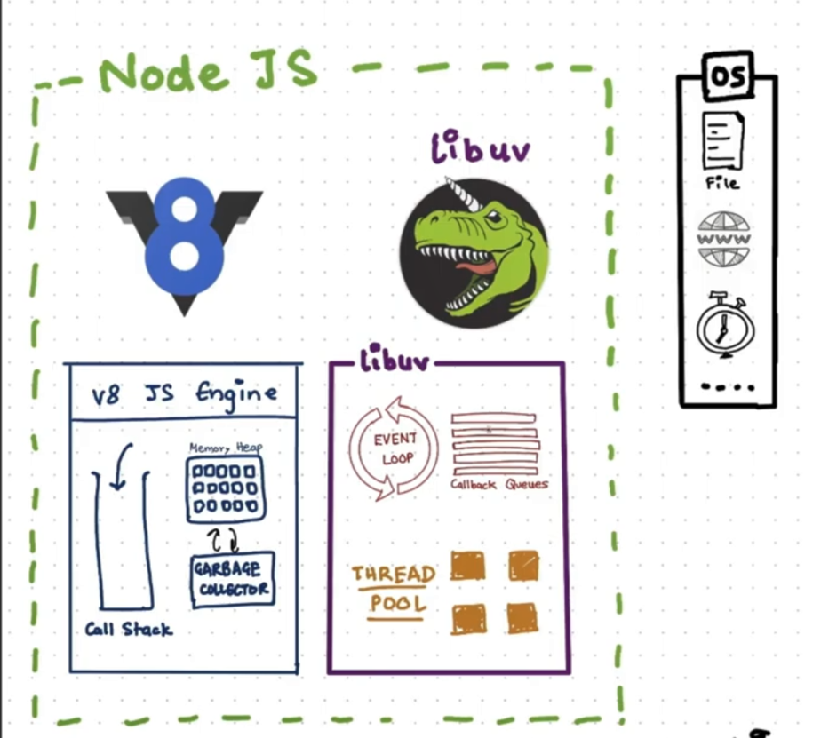
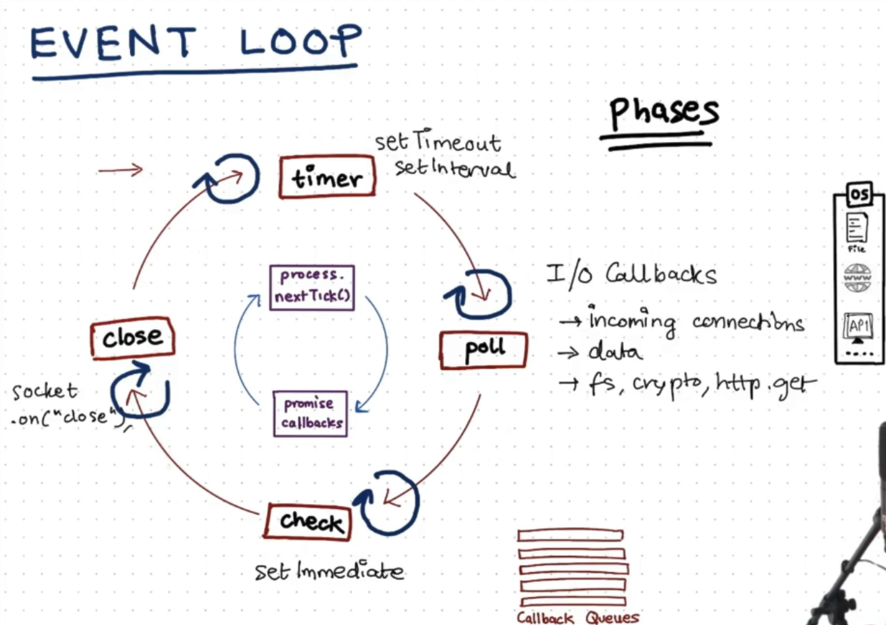
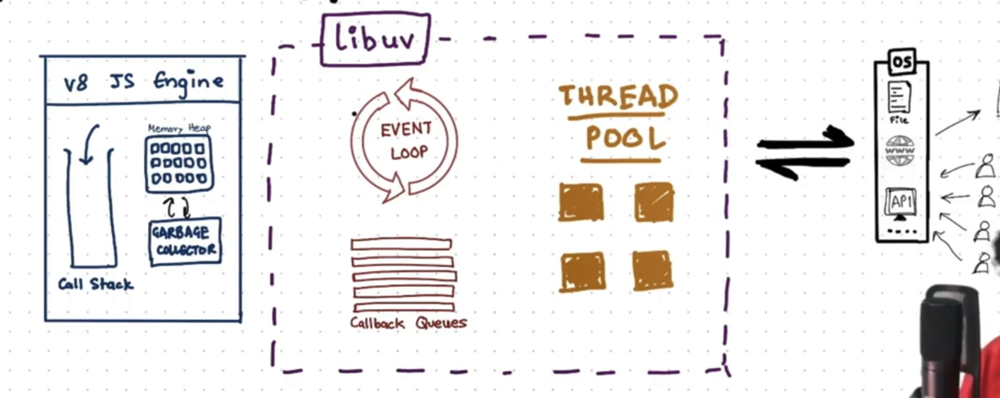
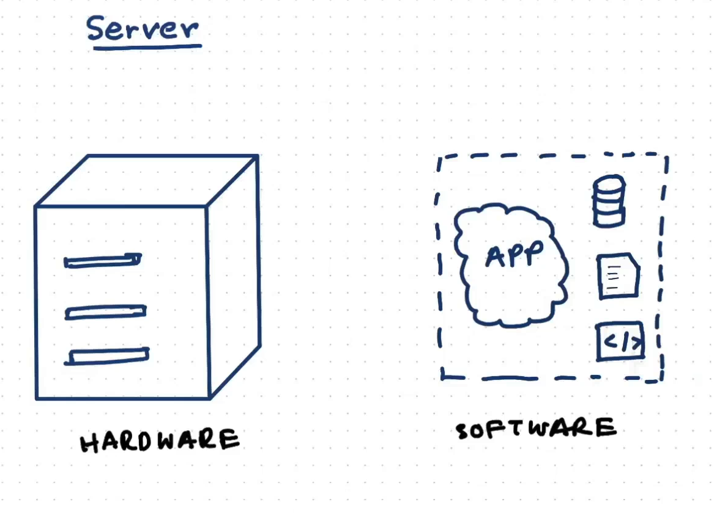
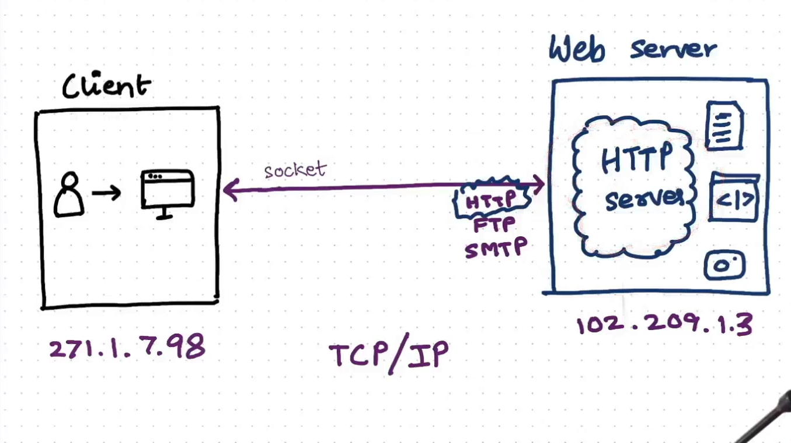
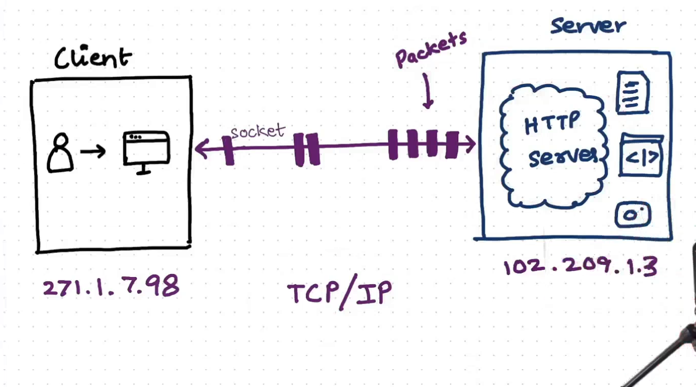
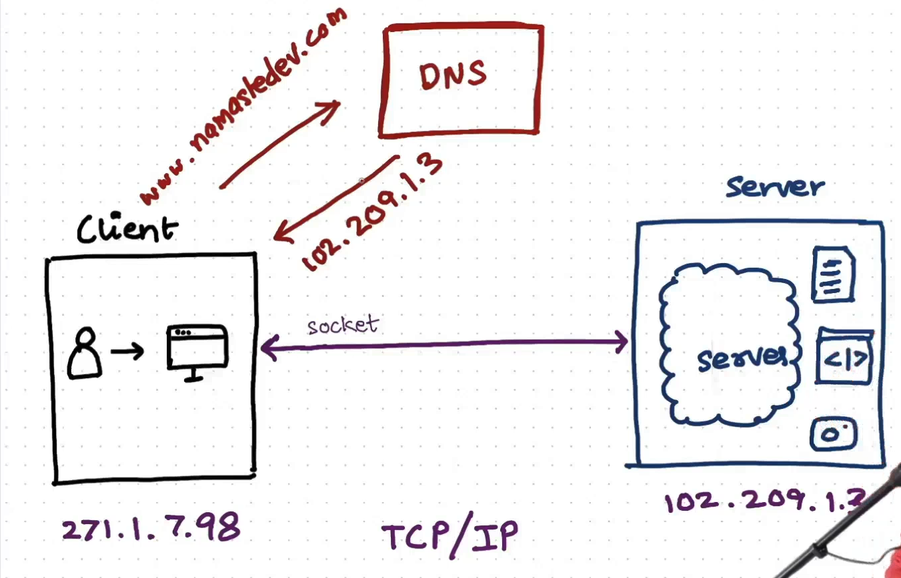
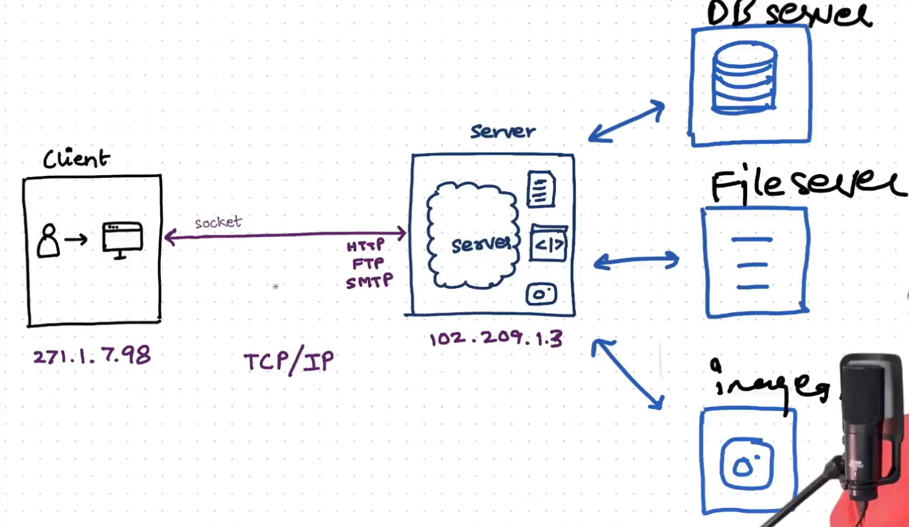

# Overview

Node Js is a JavaScript runtime built on Chrome's V8 JavaScript Engine.

> `globalThis` keyword can be used to access the global object in both browser and node.<br>
> __In Browser:__ `this`, `global`, `self`, `frame`.. can also be used.<br>
> __In NodeJs:__ `global` can also be used.

---

## require

`require` is a built-in function used to load modules, JSON, or local files. It's part of the CommonJS module system. When you use require(), Node.js loads the specified module and makes its exported functions, objects, or variables available in the current file.

```js
const express = require('express');
```

---

## Module Type

In Node.js, the `type` field in a package.json file determines how the JavaScript code is interpreted — whether it uses CommonJS or ES modules. The two primary module systems are:
1. __CommonJS (CJS)__ - The default system used by Node.js (`require` and `module.exports`) (no type)
2. __ES Modules (ESM)__ - The standard module system for JavaScript (`import` and `export`) (type: "module")

```js
// file1.js

// CJS
var x = "Hello World"

function calculateSum(a, b){
    const s = a + b;
    console.log(s);
}

module.exports = {
    x : x, // or just x
    calculateSum : calculateSum // or just calculateSum
}

// ESM
var x = "Hello World"

export function calculateSum(a, b){
    const s = a + b;
    console.log(s);
}

// file2.js

// CJS
const { x, calculateSum } = require("./file1.js");
calculateSum(3, 4);

// or

const obj = require("./sum.js")
obj.calculateSum(3, 4)
console.log(obj.x)

// ESM
import { calculateSum } from "./file1.js";
calculateSum(3, 4);
```

```
    CJS(Common JS Module)               vs               ESM(Ecma Script Module)
1.  module.exports and require()                         import export
2. By default used in node js                            By default used in React, Angular
3. Older way                                             Newer way
4. Synchronous                                           Asynchronous
5. Non Strict Mode                                       Strict Mode
```

> `module.exports` is an empty object.

> Strict Mode doesn't allow errors to be ignored. For example, assigning a = 10 without declaring it using var, let, or const will throw an error in Strict Mode, whereas it would be allowed in non-strict mode, making a a global variable.

---

## Immediately Invoked Function Expression (IIFE)

```js
function() {
    // Code
}) ();
```
> When we use `require("/path")`, the entire module's code is enclosed within an Immediately Invoked Function Expression (IIFE).

---



## V8 Engine

### Types of Languages

```
Interpreted                        vs                Compiled
1. Line by Line Execution                            First Compilation then Execution (High Level Code -> Machine Code)
2. Fast Initial Execution                            Initially heavy but executed fast
3. Interpretter                                      Compiler
```

> Code -> Parsing -> Compilation + Interpretation -> Execution

The V8 Engine processes code in two steps. First, it performs tokenization (or lexical analysis), converting the code into tokens. Then, in the second step, it conducts syntax analysis (or parsing) to transform these tokens into an Abstract Syntax Tree (AST).

> Code that is repeatedly executed (eg:- function) is known as hot code.

```
// JUST IN TIME COMPILATION
      -----  
     | AST |
      -----  
        |
        |                     Hot Code            -----------------
        ↓                  --------------->      |Turbofan Compiler|
 --------------------        Optimization         -----------------
|Ignition Interpreter|                                     |
 --------------------                                      ↓
        |                   Deoptimization        ----------------------
        |                  <---------------      |Optimized Machine Code| // If there is any changes in the code it will
        ↓                                         ----------------------     deoptimize.
    ---------                                              |
   |Byte Code|                                             |
    ---------                                              |
        |                                                  |
         --------------------------------------------------
                                   |
                                   ↓
                               ---------                             
                              |Execution|
                               ---------
```

Garbage Collection is also part of the process.
- Orinoco
- Oil Pan
- Scavenger
- MCompact

---

## libuv Library

- libuv is a C library originally developed for Node.js to provide support for asynchronous I/O(non-blocking IO), handling things like files, network connections, and timers.
- It offers an event loop, asynchronous file and socket operations, timers, child processes, and other core I/O features essential for Node.js.
- Since it's in C, it provides a bridge that lets Node.js, written in JavaScript, manage low-level system interactions more efficiently.

### Event Loop

 

It is what allows Node.js to perform non-blocking I/O operations — despite the fact that a single JavaScript thread is used by default — by offloading operations to the system kernel whenever possible.

When Node.js starts, it initializes the event loop, which continuously checks for and processes tasks (also called events). The event loop consists of phases that manage different types of operations:

- Timer -> setTimeOut(), setInterval()
- Poll -> I/O callback, Incoming Connection, Data, fs, crypto, http, get
- check -> setImmediate()
- close -> socket.on("close")

When an asynchronous operation is handled by libuv, it waits in its designated callback queue. The event loop continuously monitors the main call stack, and when it finds it empty, it pushes the operation into the stack. `setTimeOut` and `setInterval` callbacks are executed first, followed by the `poll phase` callbacks, then `setImmediate` and finally `close` callback. Before entering each phase, the event loop runs a separate check to execute any callbacks queued by `process.nextTick()` and resolved `Promise` callbacks. This ensures that these callbacks are prioritized and processed immediately before moving on to the next phase in the event loop.

#### Examples

```js
// Example 1
const a = 100;

setImmediate(() => console.log("setImmediate"));

fs.readFi1e(" ./fite.txt, "utf8", () => {
    console. log ("File Reading CB");
}

setTimeout(() => console.log("Timeout expired");

function printA() {
    console.log("a=", a);
}

printA() ;
console.log("Last line of the file.");


// Output
a=100
Last Line of the file.
Timeout Expired.
setImmediate
File Reading CB        // File Reading takes time depends on the file size.
```

```js
// Example 2
setImmediate(() => console.log("Immediate");

setTimeout(() console.log("Timer expired"), 0);

Promise.resolve(() => console.log("Promise");

fs.readFile("./file.txt", "Utf8", () => {
    setTimeout(() => console.log("2nd timer")), 0);

    process.nextTick(() => console.log("2nd nextTick"));

    setImmediate(() console. log(" 2nd Immediate"));

    console.log("File Reading CB");
});

process.nextTick(() => console.log("nextTick"));

// Output
nextTick
Promise
Timer Expired
Immediate
File Reading CB
2nd nextTick
2nd Immediate
2nd timer
```

> When the event loop completes a cycle, it pauses in the `poll` phase. Therefore, any nested operations will start from the poll phase.

```js
// Example 3
setImmediate(() => console. tog ("setImmediate"));

setTimeout(() => console.log("Timer expired"), 0);

fs.readFile("./file.txt", "utf8", () => {
    console.log("File Reading CB");
});

process.nextTick(() => {
    process.nextTick(() => console.log("inner nextTick"));
    console. log ("nextTick");
});

console.log("Last Line of the file");

// Output
Last Line of the file
nextTick
inner nextTick
Timer expired
setImmediate
File Reading CB
```

> `nextTick()` nested inside `nextTick()` will execute together.

### Thread Pool

> Node.js operates on a single thread for synchronous tasks but utilizes multiple threads for handling asynchronous operations.



Thread Pool is an implementation to manage and reuse multiple threads to perform asynchronous operations efficiently. Node.js uses a 
thread pool internally to handle non-blocking I/O operations like file system tasks, network requests, and cryptography-related tasks.

Thread pool is provided by the libuv library and has a default size of 4 threads. It can be increased using the `UV_THREADPOOL_SIZE` environment variable.

#### Tasks in Thread Pool
- File System Operations (`fs.readfile`, `fs.writeFile`)
- DNS Lookups (`dns.lookup` when not using native bindings)
- Compression / Decompression (`zlib`)
- Cryptography (`crypto` methods like `pbkdf2`, `scrypt`, etc.)

#### Examples

```js
const fs = require("fs");
const crypto = require("crypto")
process.env.UV_THREADPOOL_SIZE = 2;

crypto.pbkdf2("password , "salt", 5000000, 50, "sha512", (err, key) => {
    console.log("1 - cryptoPBKDF2 done");
});

crypto.pbkdf2("password , "salt", 5000000, 50, "sha512", (err, key) => {
    console.log("2 - cryptoPBKDF2 done");
});

crypto.pbkdf2("password , "salt", 5000000, 50, "sha512", (err, key) => {
    console.log("3 - cryptoPBKDF2 done");
});

crypto.pbkdf2("password , "salt", 5000000, 50, "sha512", (err, key) => {
    console.log("4 - cryptoPBKDF2 done");
});

crypto.pbkdf2("password , "salt", 5000000, 50, "sha512", (err, key) => {
    console.log("5 - cryptoPBKDF2 done");
});

// OUTPUT
4 - cryptoPBKDF2 done
1 - cryptoPBKDF2 done
3 - cryptoPBKDF2 done
2 - cryptoPBKDF2 done
5 - cryptoPBKDF2 done

// Any thread in the thread pool can execute first; there is no guarantee of execution order.
```

```
 -------                                OS
| libuv |     <------->    epoll (Linux) & kqueue (MacOS)
 -------

        Scalable I/O Event Notification Mechanism
```

---

## Server



A server is a __computer system or a software application__ that provides services, resources, or data to other devices, known as clients, over a network.

 _Client-Server Architecture_: Servers interact with clients (such as web browsers, mobile apps, or other devices). The server processes client requests and returns the required data or performs actions.


### Types of Server



1. HTTP - Hosts and serves web content like HTML pages, CSS, JavaScript, images, etc., to clients (e.g. browsers).
        - Examples: Apache, Nginx, Microsoft IIS, Node.js.

2. FTP  - Facilitates file transfers between computers.
        - Examples: FileZilla Server, vsftpd, ProFTPD.

3. SMTP - Handles the sending and routing of emails across the internet.
        - Examples: Postfix, Sendmail, Microsoft Exchange.



Packet transfer involves sending and receiving data across a network in small units known as packets. This method, essential for internet functionality and most computer networks, enables efficient and reliable data communication.



The DNS (Domain Name System) client-server relationship is a fundamental mechanism that facilitates domain name resolution, allowing users to access websites and services using human-readable domain names (e.g., example.com) instead of IP addresses (e.g., 192.168.1.1).



Multiple servers can be created, each configured to use a different port number.

> A socket connection transfers data and then disconnects, whereas a WebSocket maintains an ongoing connection.
```
Domain Name <------> IP + Port
Path        <------> API

Link - IP + Port + API

demo.com/ api/getUserInfo
|_______| |_| |_________|
    |      |       |
123.4.5.6:3000   Code
            |     
        HTTP Server
```

---

## DataBase

A database is a organized collection of data or a type of data store based on the use of database management system (DBMS). Often the term database also used loosely to refer to any of the DBMS, the database system or an application associated with the database.

### Types of Database

1. __Relational Database__ - MySQL, PostgreSQL
2. __NoSQL DB__ - MongoDB
3. __In memory DB__ - Redis
4. __Distributed SQL DB__ - Cockroach DB
5. __Time Series DB__ - Influx DB
6. __Object Orientd DB__ = db40
7. __Graph DB__ - Neo4j
8. __Hierachial DB__ - IBM IMS
9. __Network DB__ - IDMS
10. __Cloud DB__ - Amazon RDS

#### RDBMS (MySQL) vs NoSQL (MongoDB)
   - Table, Rows, Columns | Collection, Document, Fields  
   - Structured Data | Unstructured Data
   - Fixed Schema | Flexible Schema
   - SQL | Mongo (MQL), Neo4J(Cypher)
   - Tough Horizontal Scaling | Easy to scale horizontally + vertically
   - Relationships (foreign keys + joins) | Nested [Relationships]
   - Read heavy apps, transaction workloads | Real Time, Big Data, Distributed Computing
   - Eg. Banking Apps | Eg. Real Time Analytics, Social Media


#### Example
```
// RDBMS - Table
 --------------------------------------------
| ID | first_name | last_name | phone | city |
 --------------------------------------------
| 01 |     Om     |   Keshri  | xxxxx | xxxx |
 --------------------------------------------
| 02 |    xxxx    |   xxxxxx  | xxxxx | xxxx |
 --------------------------------------------

// NoSQL - Collection
{
    "id": 1,
    "first_name": "xxxx",
    "last_name": "xxxx",
    "phone": "xxxx",
    "city": "xxxx",
    "hobbies": ["reading", "working"]
}

```

---

## Monolith and Microservices 

A monolithic architecture is a software design approach where all components of an application (user interface, business logic, and data access) are built into a single, tightly-coupled unit. All functionalities reside in a single codebase and are deployed as one unified executable or application.

A microservices architecture is a software design pattern where an application is broken into a collection of small, loosely-coupled, and independently deployable services. Each service is responsible for a specific functionality and communicates with other services using lightweight protocols like HTTP/REST, gRPC, or messaging queues.

---

